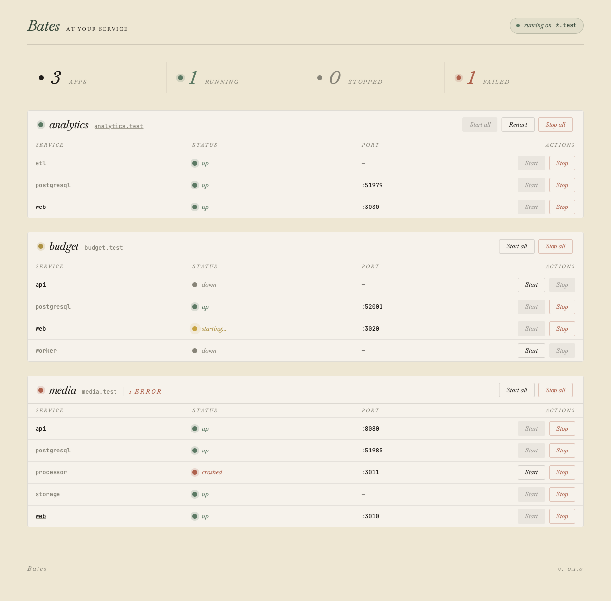

# Bates

A local multi-application development server.

<a href="docs/images/dashboard.png"></a>

There’s support for running multiple services for handling things like CSS
preprocessors and background jobs (similar to [Foreman][]). There’s also
built-in support for managing dependencies using [`asdf`][], loading
environment variables with [`direnv`][], and running per-app instances of
PostgreSQL.

[Foreman]: http://blog.daviddollar.org/2011/05/06/introducing-foreman.html
[`direnv`]: https://direnv.net
[`asdf`]: https://asdf-vm.com

## Setup

### Install Caddy

```bash
brew install caddy
```

### Configure DNS resolver

Create a resolver file so `.test` domains resolve to localhost:

```bash
sudo bash -c 'echo "nameserver 127.0.0.1" > /etc/resolver/test'
```

### Trust the Caddy CA

Caddy automatically generates SSL certificates for local domains. Trust
its root CA so browsers accept the certificates:

```bash
caddy trust
```

## Build and Run

Bates ships two binaries: `batesd` (the server, a Mix release) and
`bates` (a thin escript client for control commands). From `source/`:

```bash
mix deps.get
mix escript.build               # produces source/bates (the CLI)
MIX_ENV=prod mix release batesd # produces source/_build/prod/rel/batesd/
```

Run the daemon in the foreground:

```bash
_build/prod/rel/batesd/bin/batesd
```

Pass `--config <path>` to override the default config location
(`~/.config/bates/config.toml`). Ctrl-C shuts the daemon down.

The `bates` escript talks to the running daemon via the JSON API.
With `bates` and `batesd` both on `$PATH`:

```bash
bates status
bates env myapp
```

## Configuration

The configuration file is defined in [TOML][] format.

[toml]: https://toml.io

```toml
[test_server]
root = "/apps/test_server"
command = "rails server -p $PORT"
addons = ["postgresql"]
middleware = ["direnv"]
```

The command will have the `$PORT` placeholder replaced with a dynamically
assigned port at startup. A port may be manually specified via the `port` key,
instead.

Multiple services are supported, as well.

```toml
[multi_service_app]
root = "/apps/multi_service_app"
middleware = ["direnv"]

  [multi_service_app.services.web]
  hostname = true
  command = "bin/rails server"

  [multi_service_app.services.css]
  command = "bin/rails tailwindcss:watch[always]"
```
